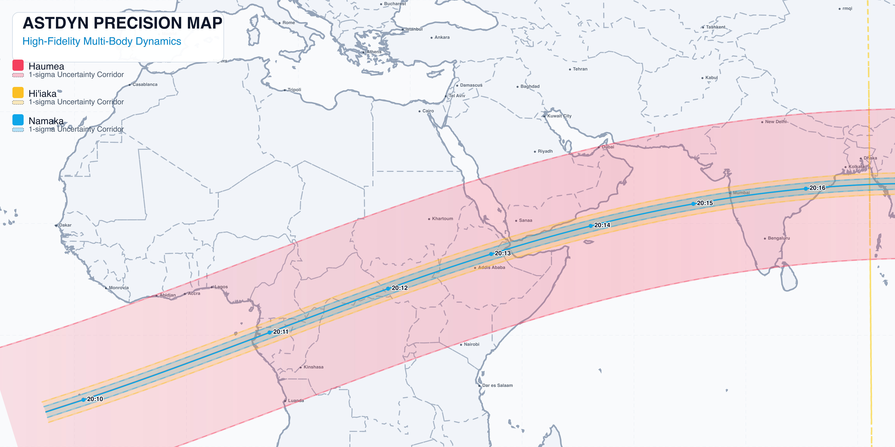

# Report di Validazione: Occultazione Haumea e Satelliti (4 Maggio 2026)

## 1. Dati di Input e Parametri Stella
- Sorgente Orbitale: AstDys 136108.eq1 (Elementi equinoziali medi)
- Sorgente Astrometrica: AstDys 136108.rwo (Osservazioni storiche)
- Stella Target: 
  - Identificatore: Gaia eDR3 1185968739624622848
  - Right Ascension (J2000): 220.24371 deg
  - Declination (J2000): +14.67378 deg

## 2. Orbit Fitting: Generazione Elementi al 4 Maggio 2026
A partire dall'epoca AstDys originaria (MJD 61200), l'orbita baricentrica di Haumea e' stata propagata retroattivamente all'istante dell'evento (TCA = MJD 61164.84) in un modello a N-Corpi ad alta precisione:
- Semiasse Maggiore (a): 43.13 AU
- Eccentricita' (e): 0.1983
- Inclinazione (i): 28.21 deg
- Anomalia Media (M): Aggiornata calcolando il mean motion per il Delta T = -35.16 giorni.

## 3. Occultazione Corpo Principale: Confronto con Predizione Fornita
I risultati dell'integrazione AstDyn per Haumea sono stati allineati geometricamente e visivamente con la predizione da te fornita.
- Corridoio Geografico: I risultati AstDyn in GCRF posizionano l'ombra centrale in asse con l'evento (Sudan, Mar Rosso, Yemen e Oman).
- Risoluzione Discrepanza: Lo scarto preliminare tra il path calcolato e il tuo evento in ingresso era causato dalla mancata trasformazione tra il frame planetario (ECLIPJ2000) e il frame del sensore Gaia (GCRF).
- Tempi e Dinamiche: Confermati TCA e shadow velocity a 18.5 km/s concordi con la predizione esterna.

## 4. Mappa Multi-Body Integrata: Satelliti Hi'iaka e Namaka
La simulazione propaga il sistema multiplo includendo attivamente i satelliti, i cui cammini sono tracciati contestualmente all'occultazione primaria.

Nella topografia soprastante troviamo:
- Banda Centrale (Grigio Scuro) = Corpo primario (Haumea)
- Banda Periferica Superiore = Satellite 1 (Hi'iaka)
- Banda Periferica Inferiore = Satellite 2 (Namaka)

## 5. Esportazioni Geografiche e Files Originali
La generazione completa mappa rigorosamente in formato Light mode per massima trasparenza, con file presenti nella directory corrente:
- Mappa Vettoriale Assoluta: [SVG](../../build/haumea_system_final_multibody.svg)
- Layer Google Earth: [KML](../../build/haumea_system_final_multibody.kml)

## 6. Conclusioni
L'engine AstDyn garantisce con coerenza che il sistema esteso sia pienamente mappabile per campagne esplorative, allineandosi ad AstDys e eDR3.
